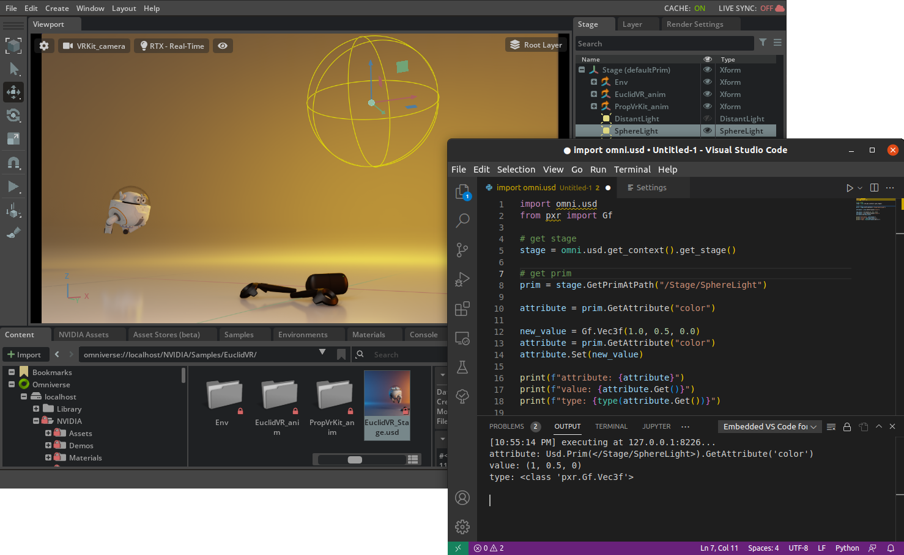
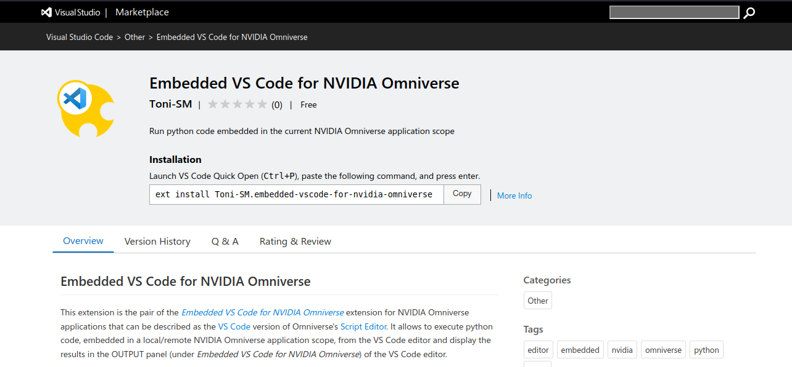
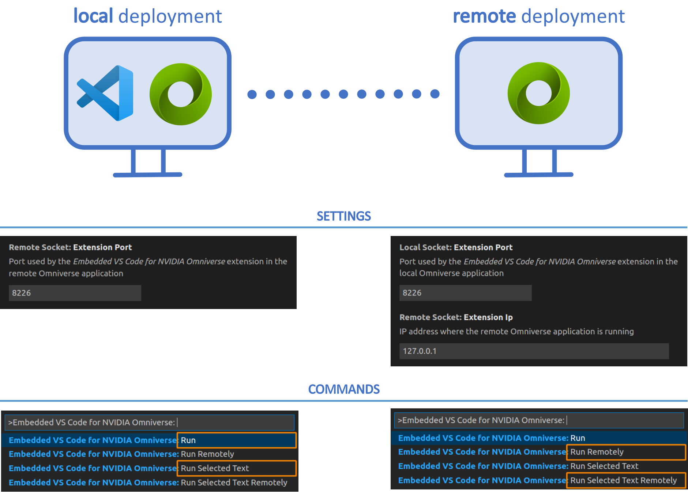
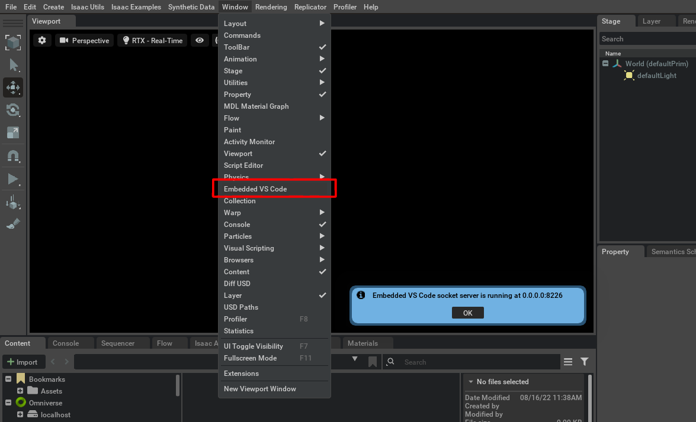
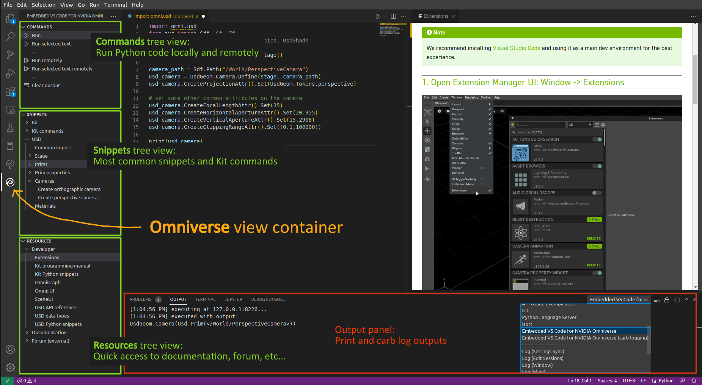

## Embedded VS Code for NVIDIA Omniverse

> This extension can be described as the [VS Code](https://code.visualstudio.com/) version of Omniverse's [Script Editor](https://docs.omniverse.nvidia.com/prod_extensions/prod_extensions/ext_script-editor.html). It allows to execute Python code, embedded in the current NVIDIA Omniverse application scope, from the VS Code editor and displays the results in the OUTPUT panel (under *Embedded VS Code for NVIDIA Omniverse*) of the VS Code editor

<br>

**Target applications:** Any NVIDIA Omniverse app

**Supported OS:** Windows and Linux

**Changelog:** [CHANGELOG.md](exts/semu.misc.vscode/docs/CHANGELOG.md)

**Table of Contents:**

- [Requirements](#requirements)
- [Extension setup](#setup)
- [Extension usage](#usage)
- [VS Code interface](#interface)
- [Configuring the extension](#config)
- [Limitations](#limitations)
- [Contributing](#contributing)

<br>



<hr>

<a name="requirements"></a>
### Requirements

This extension requires its VS Code pair extension [Embedded VS Code for NVIDIA Omniverse](https://marketplace.visualstudio.com/items?itemName=Toni-SM.embedded-vscode-for-nvidia-omniverse) to be installed and enabled in the VS Code editor instance to be able to execute code in the current NVIDIA Omniverse application scope

<br>



<hr>

<a name="setup"></a>
### Extension setup

1. Add the extension using the [Extension Manager](https://docs.omniverse.nvidia.com/prod_extensions/prod_extensions/ext_extension-manager.html) or by following the steps in [Extension Search Paths](https://docs.omniverse.nvidia.com/py/kit/docs/guide/extensions.html#extension-search-paths)

    * Git url (git+https) as extension search path

        :warning: *There seems to be a bug when installing extensions using the git url (git+https) as extension search path in Isaac Sim 2022.1.0. In this case, it is recommended to install the extension by importing the .zip file*
    
        ```
        git+https://github.com/Toni-SM/semu.misc.vscode.git?branch=main&dir=exts
        ```

    * Compressed (.zip) file for import

        [semu.misc.vscode.zip](https://github.com/Toni-SM/semu.misc.vscode/releases)

2. Enable the extension using the [Extension Manager](https://docs.omniverse.nvidia.com/prod_extensions/prod_extensions/ext_extension-manager.html) or by following the steps in [Extension Enabling/Disabling](https://docs.omniverse.nvidia.com/py/kit/docs/guide/extensions.html#extension-enabling-disabling)

<hr>

<a name="usage"></a>
### Extension usage

Enabling the extension starts a TCP socket server that executes the code sent to it from the VS Code [Embedded VS Code for NVIDIA Omniverse](https://marketplace.visualstudio.com/items?itemName=Toni-SM.embedded-vscode-for-nvidia-omniverse) pair extension according to the VS Code settings and commands shown in the image below

<br>



The VS Code extension communicates via the configured address (`WORKSTATION_IP:PORT`), which is also indicated inside the Omniverse application in the *Windows > Embedded VS Code* menu

<br>
<p align="center">
  
</p>

Disabling the extension shutdowns the TCP socket server

<hr>

<a name="interface"></a>
### VS Code interface

<br>



<hr>

<a name="config"></a>
### Configuring the extension

The extension can be configured by editing the [config.toml](exts/semu.misc.vscode/config/extension.toml) file under `[settings]` section. The following parameters are available:

<br>

**Extension settings**

<table class="table table-striped table-bordered">
  <thead>
    <tr>
      <th>Parameter</th>
      <th>Value</th>
      <th>Description</th>
    </tr>
  </thead>
  <tbody>
    <tr>
      <td>socket_ip</td>
      <td>0.0.0.0</td>
      <td>The IP address on which the TCP socket server will be listening for incoming requests</td>
    </tr>
    <tr>
      <td>socket_port</td>
      <td>8224</td>
      <td>The port on which the TCP socket server will be listening for incoming requests. In addition, the same port is used by a UDP socket to send carb logs (carb logging)</td>
    </tr>
    <tr>
      <td>carb_logging</td>
      <td>true</td>
      <td>Whether to send carb logging to be displayed in the *Embedded VS Code for NVIDIA Omniverse (carb logging)* output panel in the VS Code editor</td>
    </tr>
  </tbody>
</table>

<hr>

<a name="limitations"></a>
### Limitations

- Print output will only be available in the VS Code OUTPUT panel after complete execution of the entire or selected code. Very large prints may not be displayed in the output panel

- Print output, inside callbacks (such as events), is not displayed in the VS Code OUTPUT panel but in the Omniverse application terminal. For that propose, use the following carb logging functions: `carb.log_info`, `carb.log_warn` or `carb.log_error`. If the carb logging is enabled, the output will be displayed in the *Embedded VS Code for NVIDIA Omniverse (carb logging)* output panel

- Carb log displaying is only available from Python calls. Logs generated by NVIDIA Omniverse applications/extensions implemented with another programming language (e.g. C/C++) are not displayed in the output panel

- The kit commands snippets (with their parameters, default values and annotations) are automatically generated from the list of commands available from Create, Code and Isaac Sim on Linux. Some commands may not be available in some Omniverse applications

<a name="contributing"></a>
### Contributing

The source code for both the NVIDIA Omniverse application and VS Code editor extensions are located in the same repository (https://github.com/Toni-SM/semu.misc.vscode):

- NVIDIA Omniverse extension: `exts/semu.misc.vscode` 
- VS Code extension: `exts-vscode/embedded-vscode-for-nvidia-omniverse`
